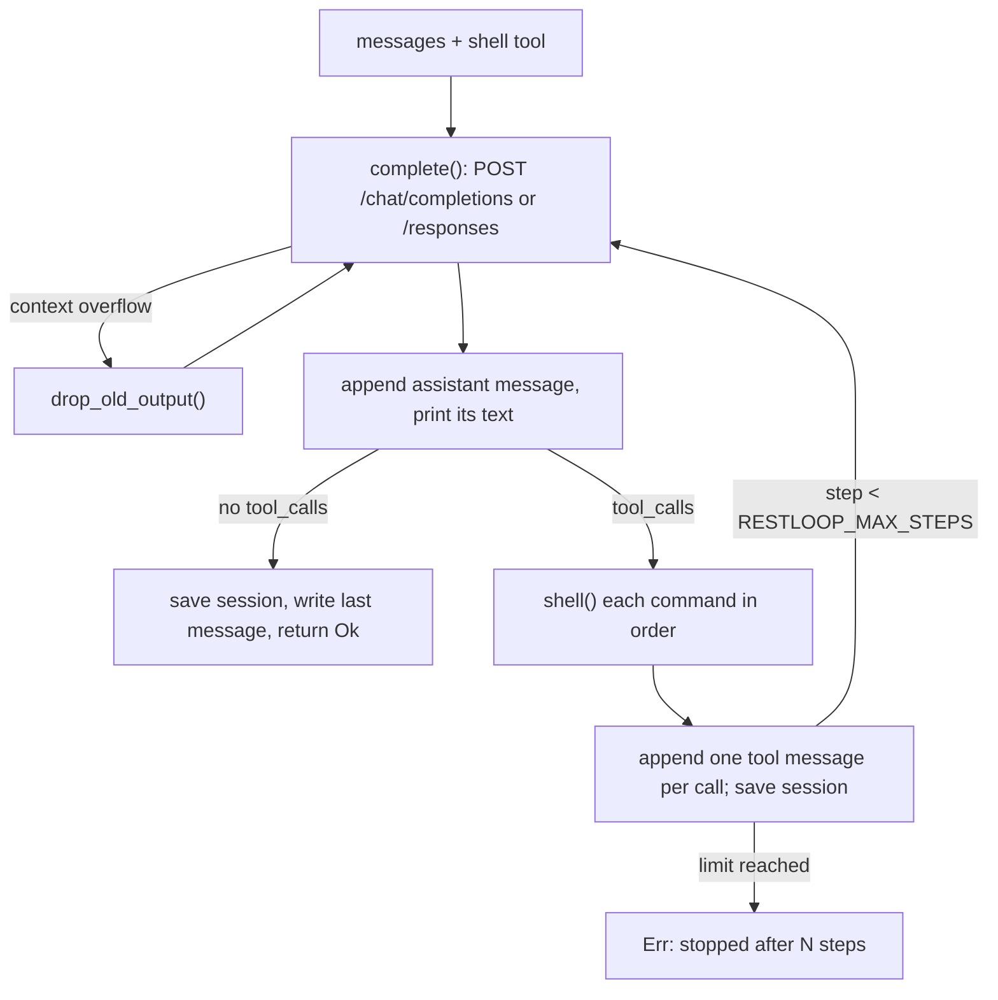

Everything happens in `run()`: one iteration (a step) is one model reply plus the commands it requested.

```mermaid
flowchart TD
  A[messages + shell tool] --> B["complete(): POST /chat/completions or /responses"]
  B -->|"context overflow"| C["drop_old_output()"] --> B
  B --> D[append assistant message, print its text]
  D -->|no tool_calls| E[save session, write last message, return Ok]
  D -->|tool_calls| F["shell() each command in order"]
  F --> G[append one tool message per call; save session]
  G -->|step < RESTLOOP_MAX_STEPS| B
  G -->|limit reached| H["Err: stopped after N steps"]
```
